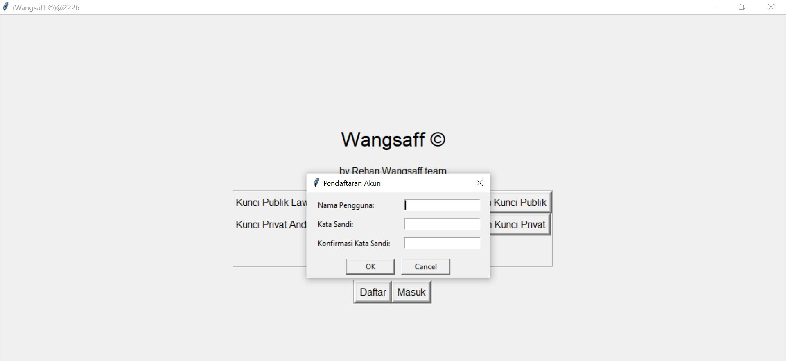
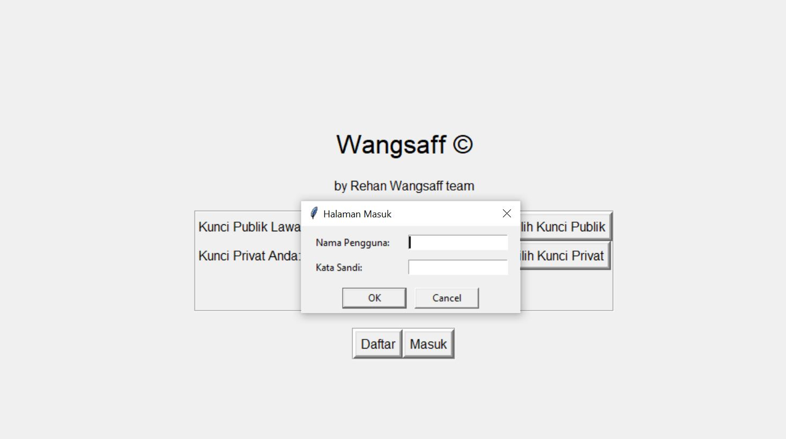
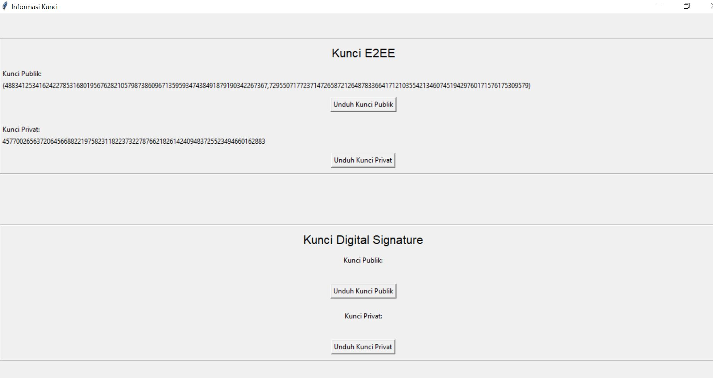
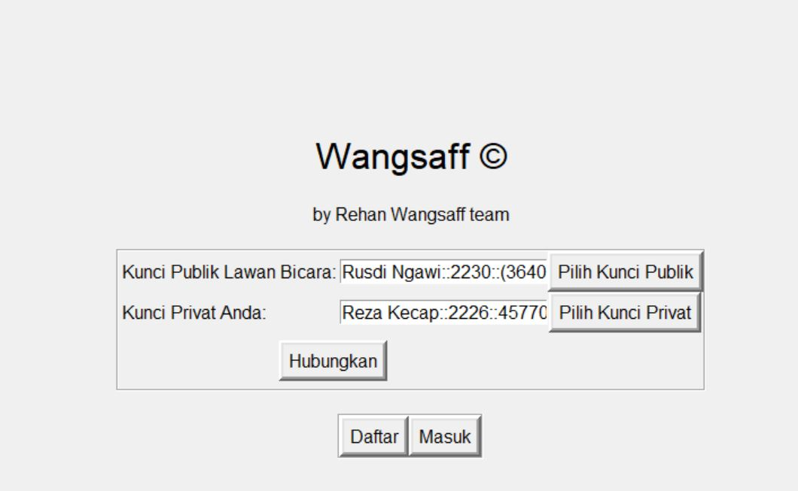
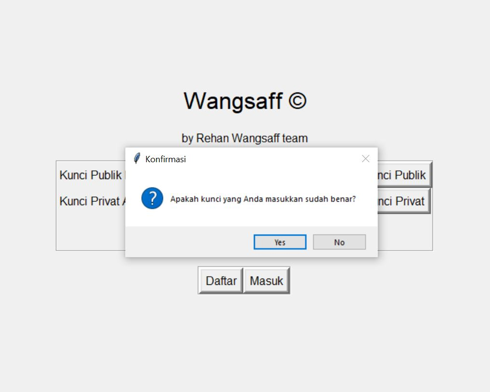
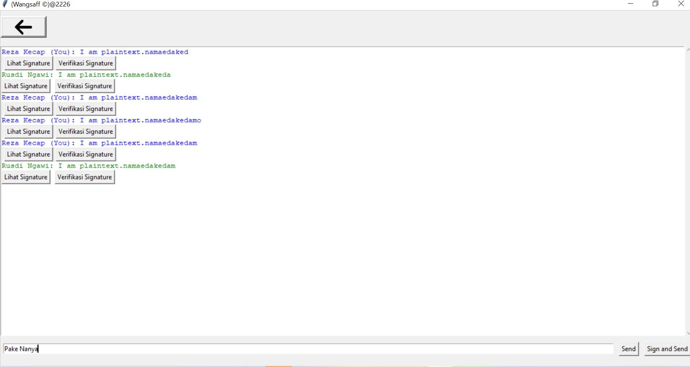

# if4020_rehan_wangsaff
Wangsaff (ditujukan untuk menghindari trademark) buatan dapur dalam negeri (100% SNI)

# Komponen
## Frontend
Dekstop based-GUI
Python

## Backend
Python

# Cara Menjalankan
## Server
```make port=PORT run-server```
Contoh:
```make port=9999 run-server```
Dengan `PORT` adalah nomor Port server dijalankan
## Klien
```make server=PORT run-client```
Contoh:
```make server=9999 run-client```
Dengan `PORT` adalah nomor `Port server` yang dituju.

# Cara Menggunakan
1. Jalankan Klien 1
2. Tekan tombol `Daftar` untuk mendaftarakan klien 1

3. Tekan tombol `Masuk` untuk mengakses kunci klien 1

4. Unduh kunci klien 1

5. Jalankan Klien 2
6. Tekan tombol `Daftar` untuk mendaftarakan klien 2

7. Tekan tombol `Masuk` untuk mengakses kunci klien 2

8. Unduh kunci klien 2

9. Masukkan `kunci publik` klien `2` dan `kunci privat` klien `1` di halaman klien 1

10. Tekan `Hubungkan`

11. Masukkan `kunci publik` klien `1` dan `kunci privat` klien `2` di halaman klien 2

12. Tekan `Hubungkan`

13. Tulis pesan yang akan dikirim di kolom bawah

14. Tekan `Send` untuk mengirim pesan atau `Sign and Send` untuk mengirim pesan dan menandatanganinya.
15. Tekan tombol `Lihat Signature` untuk melihat tanda tangan dan tombol `Verify Signature` Untuk memeriksa tanda tangan.

# Keterangan Tambahan 
Karena keterbatasan implementasi Eliptic Curve pada program ini, program hanya dapat mengirim/menerima pesan maksimal __27__ karakter unicode. Lewat dari itu maka program akan hang.